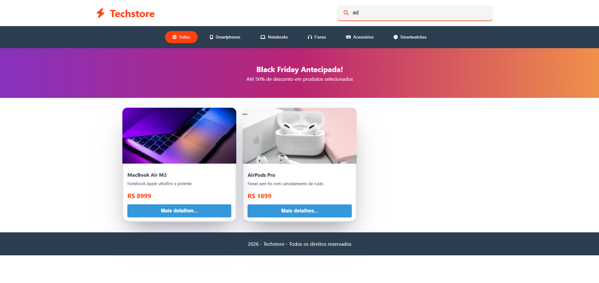

# 🪙 Currency Conversor

Uma aplicação simples de conversão de moedas, desenvolvida com HTML, CSS e JavaScript, que permite converter valores entre diferentes moedas em tempo real.

<br>

## 📸 Demonstração

### Tela Inicial


### Exemplo da troca de moeda


<br>

## 🚀 Funcionalidades

- 🔄 Conversão entre diferentes moedas (ex: BRL → USD)
- 💰 Entrada dinâmica de valor para conversão
- 🌍 Suporte a múltiplas moedas (ex: Real, Dólar, Euro, etc.)
- 📱 Layout responsivo
- ⚡ Interatividade com JavaScript (conversão instantânea)

 <br>

 ## 🛠️ Tecnologias utilizadas

- **HTML5** → estrutura da aplicação  
- **CSS3** → estilização e responsividade  
- **JavaScript** → manipulação do DOM e interatividade

<br>

## 📂 Estrutura do projeto

```bash
📦 techstore
 ┣ 📂 assets        # Imagens e ícones
 ┣ 📜 index.html    # Página principal
 ┣ 📜 style.css     # Estilos
 ┣ 📜 script.js     # Lógica JS
 ┗ 📜 README.md     # Documentação do projeto

