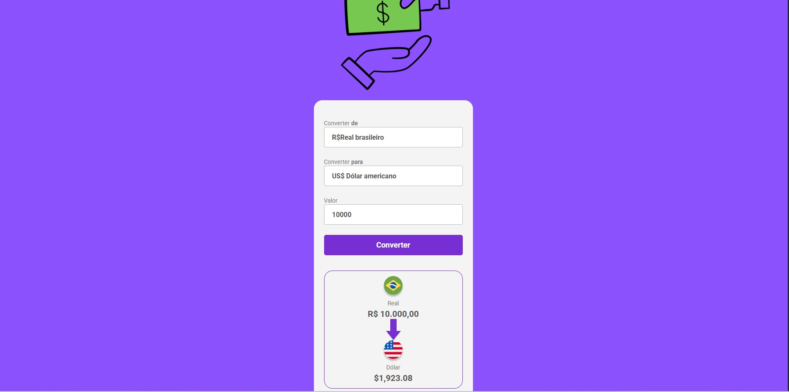

# 💱 Currency Converter

Uma aplicação web simples e interativa para **conversão de moedas**, desenvolvida com **HTML**, **CSS** e **JavaScript**.  
Permite converter valores entre diferentes moedas, como Real Brasileiro (BRL) e Dólar Americano (USD), com base em taxas de câmbio atualizadas.

---

## 📸 Demonstração

### Conversão de moedas  

---

## 🚀 Funcionalidades

- 🔁 Conversão entre moedas (ex: BRL ↔ USD)  
- 💰 Exibição do valor convertido de forma clara  
- 🌐 Interface intuitiva e responsiva  
- 📥 Entrada de valor com validação simples  
- ⚡ Lógica de conversão com JavaScript

---

## 🛠️ Tecnologias utilizadas

- **HTML5** → estrutura da aplicação  
- **CSS3** → estilização moderna e responsiva  
- **JavaScript** → lógica de conversão, manipulação do DOM e interatividade

---

## 📂 Estrutura do projeto
📦 currency-converter
┣ 📂 assets # Imagens e ícone 
┣ 📜 index.html # Página principal 
┣ 📜 style.css # Estilos 
┣ 📜 script.js # Lógica JS 
┗ 📜 README.md # Documentação do projeto
